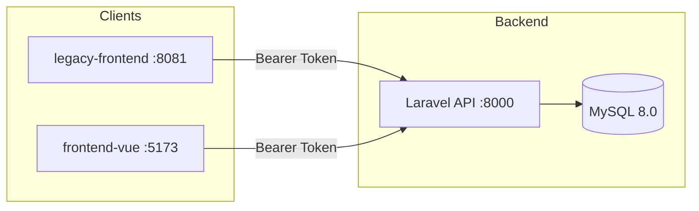
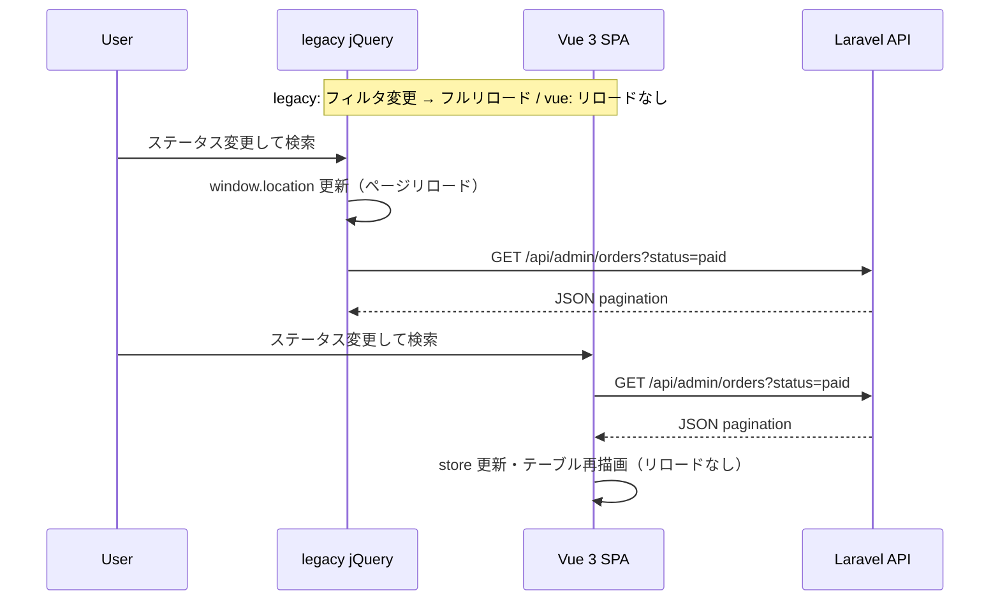

# vue-admin-replace

https://github.com/tetsushi-k/vue-admin-replace

EC 受注管理画面の **jQuery → Vue 3 段階リプレイス** を題材にしたポートフォリオです。同一 Laravel API に対して legacy（jQuery）と Vue 3 を並行稼働させ、Before / After の差分を比較できます。

## 1. 概要

長年 jQuery で運用されてきた受注一覧画面を、API 境界を固定したまま Vue 3 + Element Plus へ段階移行する構成です。

- **Before**: `legacy-frontend/` — フィルタ変更でページ全体をリロード、DOM を文字列連結で生成
- **After**: `frontend-vue/` — Pinia で状態管理、フィルタ変更は API 再取得のみ（リロードなし）
- **API**: Laravel 11+ Sanctum 認証、admin ロールのみ受注一覧にアクセス可能

## 2. 使用技術

| レイヤー | 技術 |
|---------|------|
| API | Laravel 11+, Sanctum, MySQL 8.0 |
| Legacy UI | HTML, jQuery, nginx |
| Vue UI | Vue 3, Vite, TypeScript, Element Plus, Pinia, Vue Router |
| インフラ | Docker Compose, Makefile |
| テスト | PHPUnit, Vitest |

## 3. アーキテクチャ図

legacy（jQuery）と vue（Vue 3）は **同一 API** を Bearer トークンで呼び出し、フロントのみ実装方式が異なります。

### 構成図



### シーケンス図（フィルタ変更時）



## 4. 設計上の工夫

### jQuery 版の問題点（意図的に残した Before）

- フィルタ検索時に `window.location` でクエリ付きフルリロード
- テーブル行を文字列連結で DOM 生成（XSS リスク・保守性の課題）
- 状態がグローバルスコープと localStorage に分散

### Vue 版の改善

- **コンポーネント分割**: `OrderFilterBar` / `OrderTable` / `OrderPagination` / `OrderDetailModal`
- **Pinia**: 検索条件・一覧・loading / error を一元管理
- **リロードなし**: フィルタ変更 → `applyFilters()` → API 再取得
- **UX**: `v-loading`、0 件時の `el-empty`、ステータスバッジ

### API 境界

- 認証・認可・ページネーション形式を API に集約
- legacy / vue 双方が同じ `GET /api/admin/orders` を利用
- CORS で `localhost:5173` と `localhost:8081` を許可

## 5. ローカル起動方法

### 前提

- Docker / Docker Compose
- Make

### セットアップ

```bash
git clone https://github.com/tetsushi-k/vue-admin-replace.git
cd vue-admin-replace
make setup
```

`make setup` は以下を実行します。

1. `docker compose up -d --build`
2. `composer install`（app コンテナ）
3. `.env` 生成・`APP_KEY` 生成
4. `migrate` + `db:seed`
5. `npm install`（frontend コンテナ）

### 日常操作

```bash
make up        # 起動
make down      # 停止
make restart   # 再起動
make ps        # 状態確認
make logs      # ログ表示
make test      # API + Vue テスト
make bash      # app コンテナに入る
```

## 6. 動作確認

### ログイン情報

| ロール | メール | パスワード |
|--------|--------|-----------|
| admin | admin@example.com | password123 |
| staff | staff@example.com | password123 |

※ 受注一覧は **admin のみ** アクセス可能（staff は 403）

### URL

| サービス | URL |
|---------|-----|
| API | http://localhost:8000 |
| Legacy (jQuery) | http://localhost:8081 |
| Vue 3 SPA | http://localhost:5173 |

### 確認ポイント

1. **Legacy**: ログイン後、ステータスを変更して「検索」→ URL が変わりページがリロードされる
2. **Vue**: 同じフィルタ操作でページリロードなしに一覧が更新される
3. **API**: `GET /api/admin/orders` が Laravel 標準 pagination（`data`, `meta`, `links`）を返す
4. **Seeder**: 55 件の受注データでページネーション（20 件/ページ）が動作する
5. **Vue 詳細モーダル**: 受注一覧の行をクリック → 詳細モーダルが開き、一覧と同じ項目が表示される。× ボタンまたは背景クリックで閉じられる

## 7. ディレクトリ構成

```
vue-admin-replace/
├── src/                      # Laravel API（Sanctum）
├── legacy-frontend/          # jQuery 版受注一覧（Before）
├── frontend-vue/             # Vue 3 + Vite + TypeScript SPA（After）
├── aidlc-docs/               # 軽量 AI-DLC ドキュメント
├── docker/                   # Dockerfile, nginx 設定
├── docker-compose.yml
├── Makefile
├── README.md
├── .cursor/environment.json
└── .gitignore
```

## 8. 今後の拡張案

- CSV エクスポート、一括ステータス更新
- 列ソート、カラム表示切替
- staff ロール向け権限細分化
- E2E テスト（Playwright）の追加
