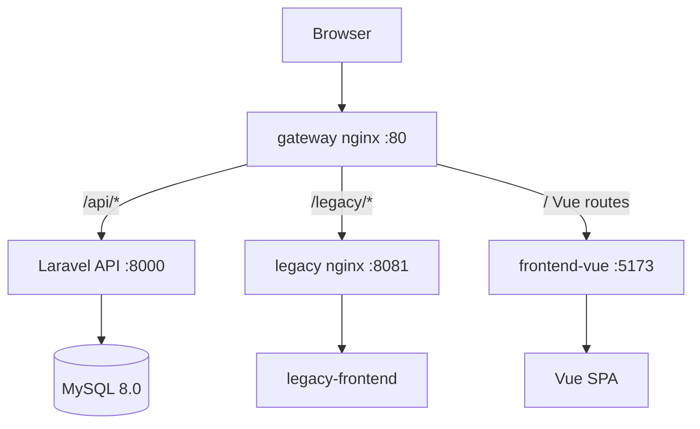
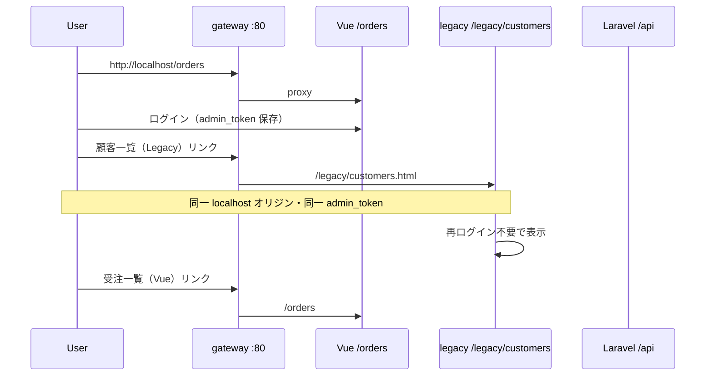

# vue-admin-replace

https://github.com/tetsushi-k/vue-admin-replace

EC 受注管理画面の **jQuery → Vue 3 段階リプレイス** を題材にしたポートフォリオです。同一 Laravel API に対して legacy（jQuery）と Vue 3 を並行稼働させ、Before / After の差分を比較できます。Phase 2 では gateway nginx により **本番想定の 1 ドメイン運用** を開発環境でも再現します。

## 1. 概要

長年 jQuery で運用されてきた受注一覧画面を、API 境界を固定したまま Vue 3 + Element Plus へ段階移行する構成です。

- **Before**: `legacy-frontend/` — フィルタ変更でページ全体をリロード、DOM を文字列連結で生成
- **After**: `frontend-vue/` — Pinia で状態管理、フィルタ変更は API 再取得のみ（リロードなし）
- **未移行**: `legacy-frontend/customers.html` — 顧客一覧は legacy のみ（段階移行デモ用）
- **API**: Laravel 11+ Sanctum 認証、admin ロールのみ受注一覧にアクセス可能
- **Gateway**: `http://localhost` から Vue / legacy / API へパス振り分け

## 2. 使用技術

| レイヤー | 技術 |
|---------|------|
| API | Laravel 11+, Sanctum, MySQL 8.0 |
| Legacy UI | HTML, jQuery, nginx |
| Vue UI | Vue 3, Vite, TypeScript, Element Plus, Pinia, Vue Router |
| Gateway | nginx（パス振り分け + Vite HMR proxy） |
| インフラ | Docker Compose, Makefile |
| テスト | PHPUnit, Vitest |

## 3. アーキテクチャ図

legacy（jQuery）と vue（Vue 3）は **同一 API** を Bearer トークン（`admin_token`）で呼び出し、gateway 経由では同一ドメインで共存します。

### 構成図



### ルーティング

| パス | 行き先 | 内容 |
|------|--------|------|
| `/api/*` | Laravel | 認証・受注 API |
| `/legacy/*` | legacy nginx | 未移行画面（orders / customers） |
| `/`, `/orders`, `/login` | Vite dev server | Vue SPA |

### シーケンス図（段階移行デモ）



## 4. 設計上の工夫

### jQuery 版の問題点（意図的に残した Before）

- フィルタ検索時に `window.location` でクエリ付きフルリロード
- テーブル行を文字列連結で DOM 生成（XSS リスク・保守性の課題）
- 状態がグローバルスコープと localStorage に分散

### Vue 版の改善

- **コンポーネント分割**: `OrderFilterBar` / `OrderTable` / `OrderPagination`
- **Pinia**: 検索条件・一覧・loading / error を一元管理
- **リロードなし**: フィルタ変更 → `applyFilters()` → API 再取得
- **UX**: `v-loading`、0 件時の `el-empty`、ステータスバッジ

### 段階移行（Phase 2）

- **gateway 統一**: 開発入口を `http://localhost` に集約（本番想定）
- **認証共有**: localStorage キー `admin_token` を legacy / Vue で共用
- **未移行画面**: customers は legacy のみ。Vue 側から `<a href>` で遷移可能
- **旧キー移行**: `legacy_token` / `vue_token` は初回読み込み時に `admin_token` へ移行

### API 境界

- 認証・認可・ページネーション形式を API に集約
- legacy / vue 双方が同じ `GET /api/admin/orders` を利用
- CORS で `http://localhost` および開発用直アクセスポートを許可

## 5. ローカル起動方法

### 前提

- Docker / Docker Compose
- Make

### セットアップ

```bash
git clone https://github.com/tetsushi-k/vue-admin-replace.git
cd vue-admin-replace
make setup
```

`make setup` は以下を実行します。

1. DB コンテナ起動
2. `composer install`（app コンテナ）
3. `.env` 生成・`APP_KEY` 生成
4. `migrate` + `db:seed`
5. 全サービス起動（gateway 含む）
6. `npm install`（frontend コンテナ）

### 日常操作

```bash
make up        # 起動
make down      # 停止
make restart   # 再起動
make ps        # 状態確認
make logs      # ログ表示
make test      # API + Vue テスト
make bash      # app コンテナに入る
```

## 6. 動作確認

### 推奨アクセス（gateway 経由）

| 用途 | URL |
|------|-----|
| **推奨入口** | http://localhost |
| Vue 受注一覧 | http://localhost/orders |
| legacy 顧客一覧（未移行） | http://localhost/legacy/customers.html |
| legacy 受注一覧（Before） | http://localhost/legacy/ |
| API | http://localhost/api/... |

### 開発用直アクセス（比較・デバッグ）

| サービス | URL |
|---------|-----|
| API 直接 | http://localhost:8000 |
| Legacy 直接 | http://localhost:8081 |
| Vue 直接 | http://localhost:5173 |

※ 直アクセス時は API が `:8000` または gateway `:80` 向きになるため、README の推奨入口（gateway）での確認を優先してください。

### ログイン情報

| ロール | メール | パスワード |
|--------|--------|-----------|
| admin | admin@example.com | password123 |
| staff | staff@example.com | password123 |

※ 受注一覧は **admin のみ** アクセス可能（staff は 403）

### 手動確認手順（gateway 経由）

1. `http://localhost/orders` を開き、admin でログイン
2. ステータスフィルタ・ページネーションが動作すること
3. ナビから「顧客一覧（Legacy・未移行）」→ `/legacy/customers.html` へ遷移
4. **再ログインなし** で顧客一覧（ダミーデータ）が表示されること
5. legacy から「受注一覧（Vue）」→ `/orders` へ戻る
6. DevTools → Local Storage に `admin_token` が 1 つだけ存在すること

### 比較確認（Before / After）

1. **Legacy 直**: `http://localhost:8081` — フィルタ変更でページリロード
2. **Vue gateway**: `http://localhost/orders` — フィルタ変更でリロードなし
3. **API**: `GET http://localhost/api/admin/orders` が Laravel 標準 pagination を返す

## 7. ディレクトリ構成

```
vue-admin-replace/
├── src/                      # Laravel API（Sanctum）
├── legacy-frontend/          # jQuery 版（orders + customers 未移行）
├── frontend-vue/             # Vue 3 + Vite + TypeScript SPA（After）
├── aidlc-docs/               # 軽量 AI-DLC ドキュメント
├── docker/
│   ├── gateway/              # gateway nginx 設定
│   ├── legacy/               # legacy nginx 設定
│   └── php/                  # Laravel コンテナ
├── docker-compose.yml
├── Makefile
├── README.md
└── .gitignore
```

## 8. 今後の拡張案

- 受注詳細モーダル・編集画面の Vue 化
- CSV エクスポート、一括ステータス更新
- 列ソート、カラム表示切替
- staff ロール向け権限細分化
- E2E テスト（Playwright）の追加

## 関連ドキュメント

- 移行計画: `aidlc-docs/inception/migration-plan.md`
- gateway 実装計画: `aidlc-docs/construction/gateway-unified-domain-plan.md`
- 設計判断: `aidlc-docs/audit.md`
