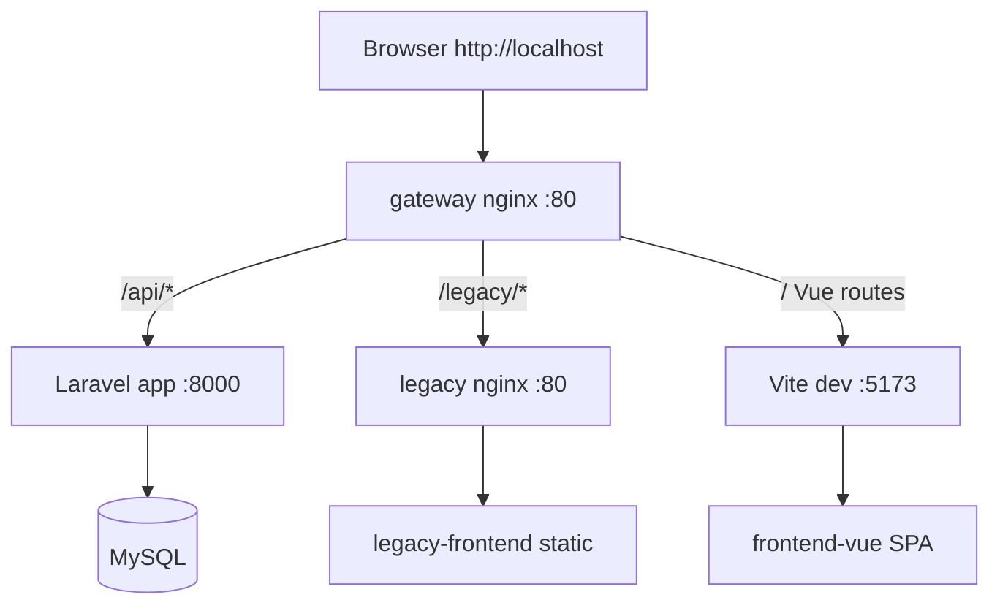

# Gateway 統一ドメイン実装計画（Construction）

## 目的

開発環境でも本番想定の **1 ドメイン + パス振り分け** を再現し、legacy（未移行）と Vue（移行済み）の共存デモを一気通貫で確認できるようにする。

### 解決する課題

| 現状 | 本番想定 | 本実装での対応 |
|------|---------|---------------|
| `:8081` / `:5173` / `:8000` の別ポート | 1 ドメイン + パス振り分け | gateway nginx `:80` を唯一の推奨入口に |
| `legacy_token` / `vue_token` が別キー | 同一ドメインでトークン共有 | `admin_token` に統一 + 旧キー移行 |
| legacy のみ orders | 未移行画面が残る | customers を legacy のみで追加 |
| Vue ↔ legacy 導線なし | 段階移行中の画面遷移 | 相互 `<a href>` リンク |

## nginx ルーティング



### location 一覧

| パス | upstream | 備考 |
|------|----------|------|
| `/api/*` | `app:8000` | Laravel API。CORS は gateway 経由時は同一オリジン |
| `/legacy/*` | `legacy:80` | プレフィックス除去して legacy nginx へ |
| `/` | `frontend:5173` | Vue SPA + Vite HMR（Upgrade ヘッダ必須） |

### 直アクセス（比較用・維持）

| URL | 用途 |
|-----|------|
| `http://localhost:8081` | legacy Before 比較 |
| `http://localhost:5173` | Vue 単体開発 |
| `http://localhost:8000` | API 直接 |

## 変更ファイル一覧

| ファイル | 変更内容 |
|---------|---------|
| `docker-compose.yml` | `gateway` サービス追加、`VITE_API_BASE_URL` を gateway 向けに |
| `docker/gateway/nginx.conf` | 新規。3 系統 proxy + WebSocket |
| `legacy-frontend/js/auth.js` | 新規。`admin_token` + 旧キー移行 |
| `legacy-frontend/js/app.js` | auth 共通化、API URL 自動判定、ナビ追加 |
| `legacy-frontend/js/customers.js` | 新規。customers ダミー一覧 |
| `legacy-frontend/customers.html` | 新規。未移行画面 |
| `legacy-frontend/index.html` | ナビ・API URL 設定更新 |
| `legacy-frontend/css/style.css` | ナビスタイル追加 |
| `frontend-vue/vite.config.ts` | HMR `clientPort: 80` |
| `frontend-vue/.env.example` | `VITE_API_BASE_URL=http://localhost` |
| `frontend-vue/src/stores/orderStore.ts` | `admin_token` + 移行 |
| `frontend-vue/src/views/OrderListView.vue` | legacy customers へのリンク |
| `src/config/cors.php` | `http://localhost` 許可 |
| `aidlc-docs/inception/migration-plan.md` | Phase 2 追記 |
| `aidlc-docs/audit.md` | PA-08〜PA-11 追記 |
| `README.md` | 推奨入口・手動確認手順 |

## 実装順

1. aidlc-docs 更新（本ファイル + migration-plan + audit）
2. `docker/gateway/nginx.conf` と `docker-compose.yml`
3. legacy customers + auth 共通化 + 導線
4. Vue token / env / vite / ナビ
5. CORS 調整
6. `make test` + 手動確認
7. README 整合

## 検証手順

### 自動

```bash
make test
```

### 手動（gateway 経由）

1. `make up` で全サービス起動
2. `http://localhost/orders` — Vue 受注一覧（ログイン: admin@example.com / password123）
3. フィルタ・ページネーションが動作すること
4. ヘッダから「顧客一覧（Legacy）」→ `http://localhost/legacy/customers.html` へ遷移
5. legacy customers がログイン状態のまま表示されること（再ログイン不要）
6. legacy から「受注一覧（Vue）」→ `/orders` へ戻る
7. DevTools → Application → Local Storage に `admin_token` のみ存在すること

### 直アクセス（比較）

- `http://localhost:8081` — legacy orders（API は `:8000` 直）
- `http://localhost:5173` — Vue（API は gateway 経由 `http://localhost`）

## 完了条件

- [ ] `http://localhost` で Vue / legacy / API に到達
- [ ] `/orders` ↔ `/legacy/customers.html` 相互遷移
- [ ] `admin_token` 統一・旧キー移行
- [ ] `make test` 成功
- [ ] aidlc-docs / README と実装一致
